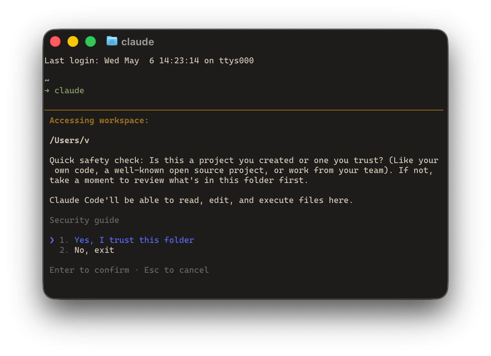
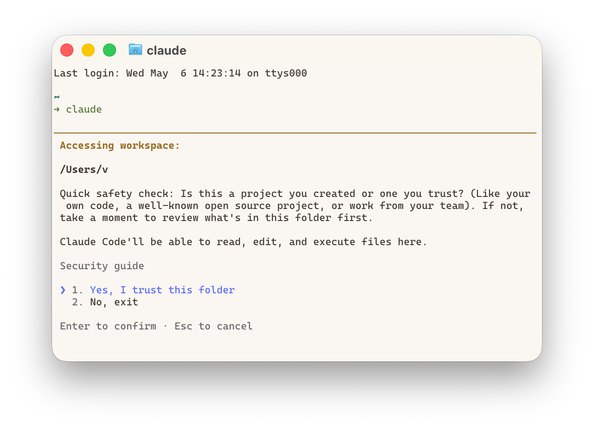

# Ghostty theme ember

a warm-toned light/dark theme for ghostty, low contrast, eye-friendly and comfortable.

## Preview





## How to install

1. Copy `themes/Ember` and `themes/Ember Dawn` to `~/.config/ghostty/themes/`.
2. Edit `~/.config/ghostty/config`:
    ```
    theme = light:Ember Dawn,dark:Ember
    ```